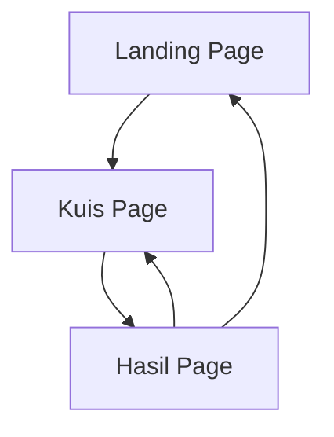

## 1. Product Overview
Red Flag Checker adalah aplikasi web bertema Valentine's yang membantu pengguna mengidentifikasi tanda-tanda peringatan (red flags) dalam hubungan melalui kuis interaktif. Aplikasi ini dirancang untuk menghibur sekaligus memberikan insight tentang hubungan dengan cara yang menyenangkan.

Target pengguna adalah orang-orang yang ingin mengevaluasi hubungan mereka atau sekadar mencari hiburan ringan dengan tema percintaan.

## 2. Core Features

### 2.1 User Roles
Tidak diperlukan pendaftaran user - aplikasi dapat digunakan secara anonim oleh semua pengunjung.

### 2.2 Feature Module
Aplikasi Red Flag Checker terdiri dari halaman-halaman berikut:
1. **Landing page**: Penjelasan aplikasi, tombol mulai kuis, tema Valentine's.
2. **Kuis page**: Pertanyaan yes/no untuk mendeteksi red flags, progress indicator.
3. **Hasil page**: Skor akhir, verdict lucu berdasarkan skor, tombol share ulang.

### 2.3 Page Details
| Page Name | Module Name | Feature description |
|-----------|-------------|---------------------|
| Landing page | Hero section | Menampilkan judul "Red Flag Checker", deskripsi singkat tentang mengidentifikasi red flags dalam hubungan, tema Valentine's dengan elemen dekoratif. |
| Landing page | CTA Button | Tombol "Mulai Kuis" yang mengarah ke halaman kuis. |
| Kuis page | Pertanyaan | Menampilkan pertanyaan yes/no tentang perilaku pasangan, contoh: "Apakah pasanganmu sering membatalkan janji tanpa alasan jelas?" |
| Kuis page | Jawaban | Dua tombol untuk jawaban Ya dan Tidak dengan warna kontras. |
| Kuis page | Progress | Indikator progress bar menunjukkan berapa banyak pertanyaan yang sudah dijawab. |
| Hasil page | Skor | Menampilkan skor akhir dalam format persentase atau kategori (contoh: "Red Flag Level: 85%"). |
| Hasil page | Verdict | Teks lucu yang menggambarkan hasil kuis, contoh: "Warning! Hubunganmu seperti lalu lintas Jakarta - penuh red flag!" |
| Hasil page | Share | Tombol untuk membagikan hasil ke media sosial atau mengulang kuis. |

## 3. Core Process
Flow pengguna dalam menggunakan aplikasi:
1. Pengguna membuka landing page dan membaca penjelasan aplikasi
2. Pengguna mengklik tombol "Mulai Kuis" untuk memulai
3. Pengguna menjawab 10-15 pertanyaan yes/no tentang hubungan mereka
4. Setelah semua pertanyaan terjawab, sistem menghitung skor
5. Pengguna melihat halaman hasil dengan skor dan verdict lucu
6. Pengguna dapat membagikan hasil atau mengulang kuis

## 4. User Interface Design

### 4.1 Design Style
- **Warna utama**: Merah (#DC2626) dan pink (#EC4899) untuk tema Valentine's
- **Warna sekunder**: Putih (#FFFFFF) dan abu-abu muda (#F3F4F6)
- **Button style**: Rounded corners dengan shadow halus, hover effects
- **Font**: Font sans-serif modern yang readable (contoh: Inter, Poppins)
- **Layout**: Card-based design dengan spacing yang comfortable
- **Icons**: Emoji dan ikon hati, bendera merah, dekorasi Valentine's

### 4.2 Page Design Overview
| Page Name | Module Name | UI Elements |
|-----------|-------------|-------------|
| Landing page | Hero section | Background gradient merah-pink, judul besar dengan font bold, ilustrasi hati dan bendera merah, teks deskripsi 2-3 baris. |
| Landing page | CTA Button | Tombol besar berwarna merah dengan teks putih, rounded-lg, shadow-md, hover:shadow-lg transition. |
| Kuis page | Pertanyaan | Card putih dengan border rounded-lg, teks pertanyaan berukuran 18-20px, nomor pertanyaan di atas. |
| Kuis page | Jawaban | Dua tombol side-by-side, tombol Ya berwarna hijau muda, tombol Tidak berwarna merah muda, ukuran besar untuk mobile-friendly. |
| Kuis page | Progress | Progress bar sederhana di bagian atas, menampilkan "Pertanyaan 3 dari 15" dengan indikator visual. |
| Hasil page | Skor | Card besar dengan background gradient, angka skor dalam font size besar (48-64px), label kategori di bawahnya. |
| Hasil page | Verdict | Teks verdict dalam bentuk quote card dengan background warna-warni lucu, emoji yang relevan. |

### 4.3 Responsiveness
Aplikasi ini menggunakan pendekatan desktop-first dengan mobile-adaptive design. Layout akan menyesuaikan untuk perangkat mobile dengan:
- Font sizes yang responsive
- Touch-friendly buttons (minimum 44px height)
- Single column layout untuk kuis pada mobile
- Hamburger menu jika diperlukan untuk navigasi tambahan

### 4.4 Animations
- Fade in untuk transisi halaman
- Hover effects pada buttons
- Pulse animation untuk CTA button di landing page
- Smooth progress bar animation
- Confetti atau sparkle effects di halaman hasil untuk skor tertentu