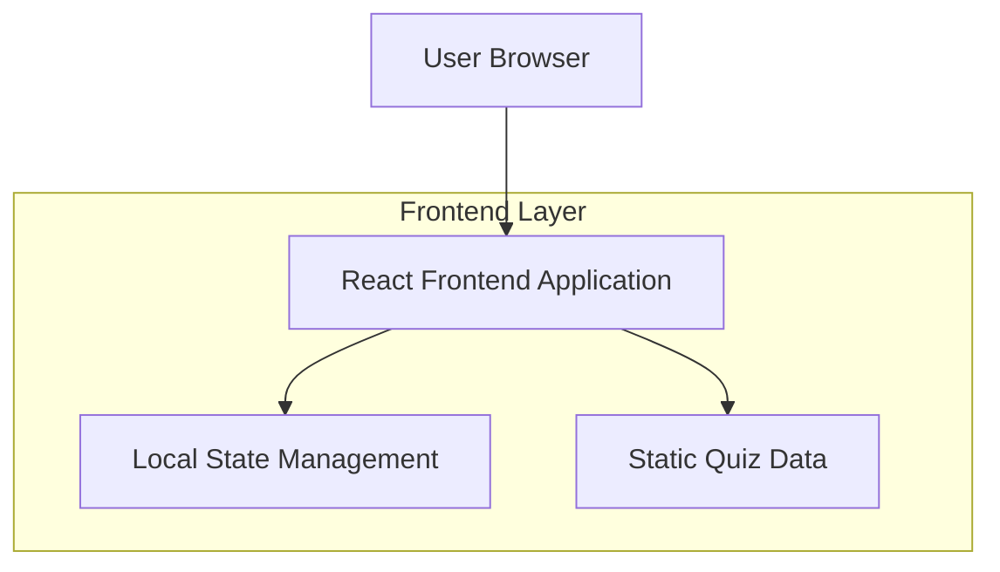
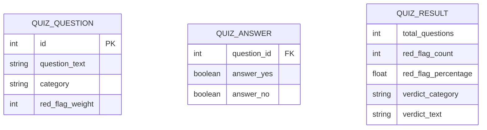

## 1. Architecture design



## 2. Technology Description
- Frontend: React@18 + tailwindcss@3 + vite
- Initialization Tool: vite-init
- Backend: None (aplikasi statis)

## 3. Route definitions
| Route | Purpose |
|-------|---------|
| / | Landing page, halaman utama dengan penjelasan aplikasi |
| /quiz | Halaman kuis dengan pertanyaan yes/no |
| /result | Halaman hasil dengan skor dan verdict |

## 4. Data model

### 4.1 Data model definition


### 4.2 Static Data Definition
Data pertanyaan kuis akan disimpan sebagai array statis dalam aplikasi:

```javascript
const quizQuestions = [
  {
    id: 1,
    question_text: "Apakah pasanganmu sering membatalkan janji tanpa alasan jelas?",
    category: "commitment",
    red_flag_weight: 3
  },
  {
    id: 2,
    question_text: "Apakah pasanganmu menghindari perkenalan dengan keluargamu?",
    category: "relationship",
    red_flag_weight: 4
  },
  // ... tambahan pertanyaan
];

const verdictCategories = [
  {
    min_percentage: 0,
    max_percentage: 25,
    category: "Safe Zone",
    verdict_text: "Selamat! Hubunganmu lebih bersih dari piring baru dicuci!"
  },
  {
    min_percentage: 26,
    max_percentage: 50,
    category: "Warning Zone",
    verdict_text: "Hati-hati! Ada beberapa tanda kecil, tapi masih bisa diperbaiki."
  },
  {
    min_percentage: 51,
    max_percentage: 75,
    category: "Danger Zone",
    verdict_text: "Warning! Hubunganmu seperti lalu lintas Jakarta - penuh red flag!"
  },
  {
    min_percentage: 76,
    max_percentage: 100,
    category: "Critical Zone",
    verdict_text: "Buzzer berbunyi! Red flag-nya lebih banyak dari bendera di peringatan 17 Agustus!"
  }
];
```

## 5. Component Structure

### 5.1 Main Components
- `App.jsx`: Root component dengan routing
- `LandingPage.jsx`: Halaman landing dengan hero section dan CTA
- `QuizPage.jsx`: Halaman kuis dengan pertanyaan dan progress
- `ResultPage.jsx`: Halaman hasil dengan skor dan verdict
- `QuestionCard.jsx`: Komponen kartu pertanyaan
- `ProgressBar.jsx`: Komponen indikator progress
- `VerdictCard.jsx`: Komponen kartu hasil dengan styling lucu

### 5.2 State Management
Menggunakan React useState dan useEffect untuk:
- Menyimpan jawaban pengguna
- Menghitung progress kuis
- Menghitung skor akhir
- Navigasi antar halaman

### 5.3 Utility Functions
```javascript
// Fungsi untuk menghitung skor red flag
const calculateRedFlagScore = (answers) => {
  const redFlagCount = answers.reduce((count, answer) => {
    return answer.answer_yes ? count + answer.red_flag_weight : count;
  }, 0);
  
  const maxPossibleScore = quizQuestions.reduce((sum, q) => sum + q.red_flag_weight, 0);
  return Math.round((redFlagCount / maxPossibleScore) * 100);
};

// Fungsi untuk mendapatkan verdict berdasarkan skor
const getVerdict = (percentage) => {
  return verdictCategories.find(
    cat => percentage >= cat.min_percentage && percentage <= cat.max_percentage
  );
};
```

## 6. Styling Approach
- Menggunakan Tailwind CSS untuk semua styling
- Warna tema: merah-rose-pink untuk Valentine's
- Responsive breakpoints: mobile-first approach
- Animasi sederhana menggunakan Tailwind transitions
- Dark mode optional (bisa ditambahkan nanti)

## 7. Performance Considerations
- Lazy loading untuk komponen halaman
- Optimasi gambar jika ada ilustrasi
- Code splitting otomatis oleh Vite
- Static data untuk pertanyaan mengurangi bundle size

## 8. Deployment Strategy
Aplikasi ini bersifat statis dan dapat dideploy di:
- Vercel (recommended)
- Netlify
- GitHub Pages
- Firebase Hosting

Tidak memerlukan server backend karena semua data bersifat statis dan logika kuis berjalan di client-side.